# 📺 CRT Scanline Plugin for VLC

> **The first native CRT scanline video filter ever made for VLC media player.**

VLC has over 4 billion downloads and is the world's most popular open-source media player, yet it has never had a native CRT shader plugin.  This bothered me enough that I spent an afternoon making one. Emulator communities have long enjoyed CRT simulation through RetroArch and mpv shader stacks, but VLC's difficult plugin architecture made this a gap no one filled - until now :).  Coded in C for the video filter, and LUA for the control panel extension.

The CRT effect might be partly nostalgic, but I find it also is easier on the eyes and lowers the brightness enough to be a soothing effect. Also improves the look of old recordings, anime, etc.  Enjoy!

Included in the files are everything you need to build (not required), .bat installer, and files for manual install.

---

## 📸 Screenshots

---

### Before / After Comparisons

| 🔴 Filter OFF | 🟢 Filter ON |
|:---:|:---:|
| 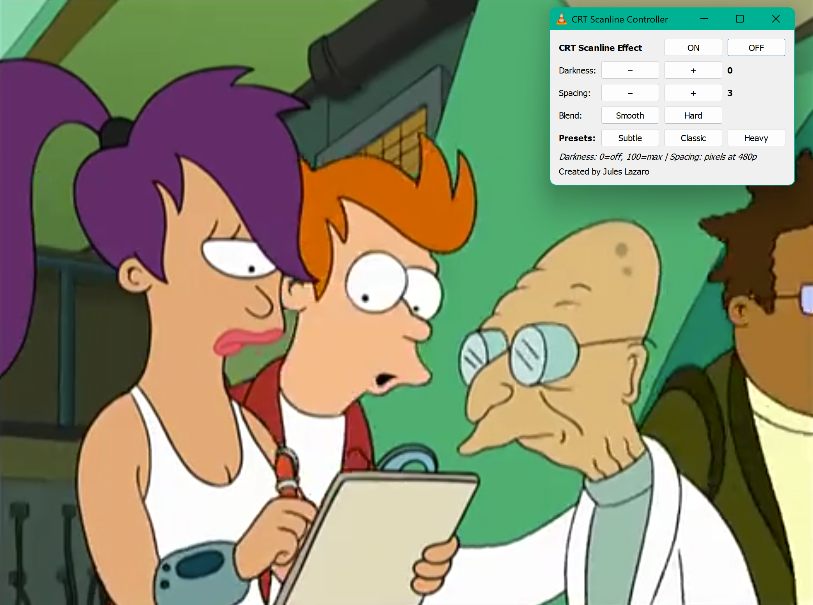 | 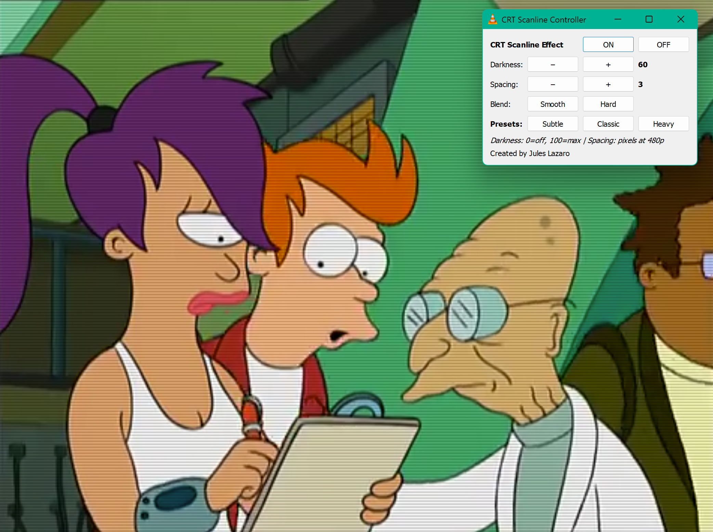 |
| 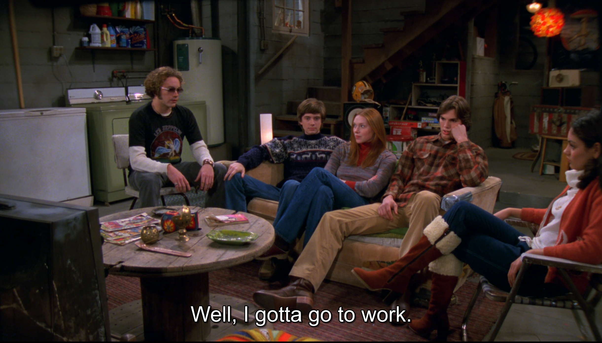 |  |
| 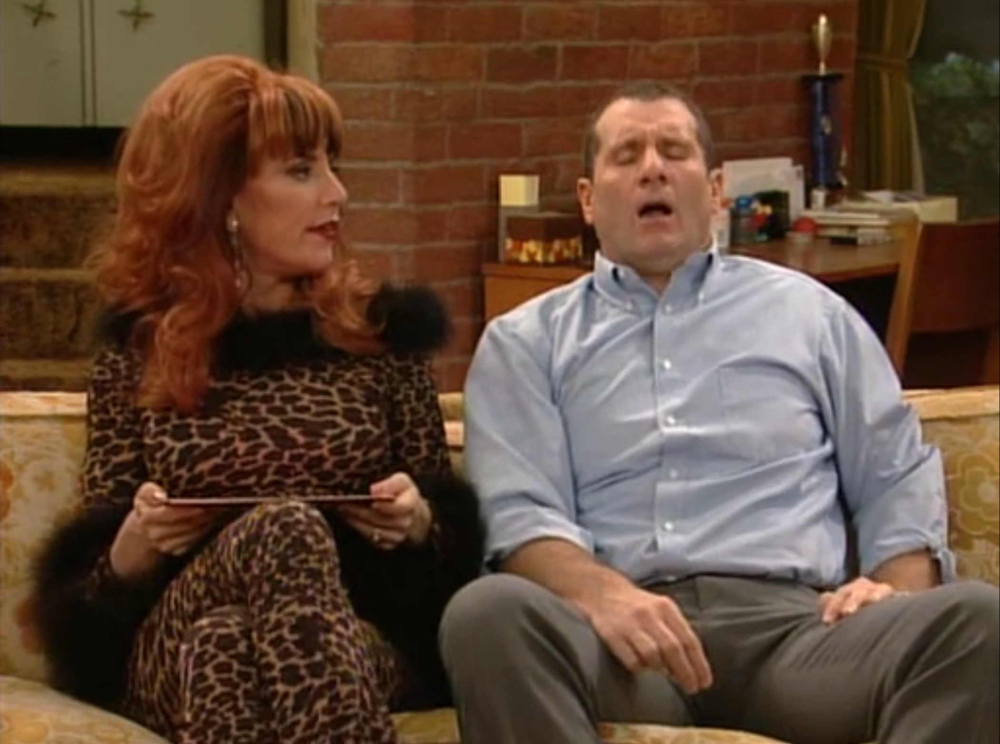 | 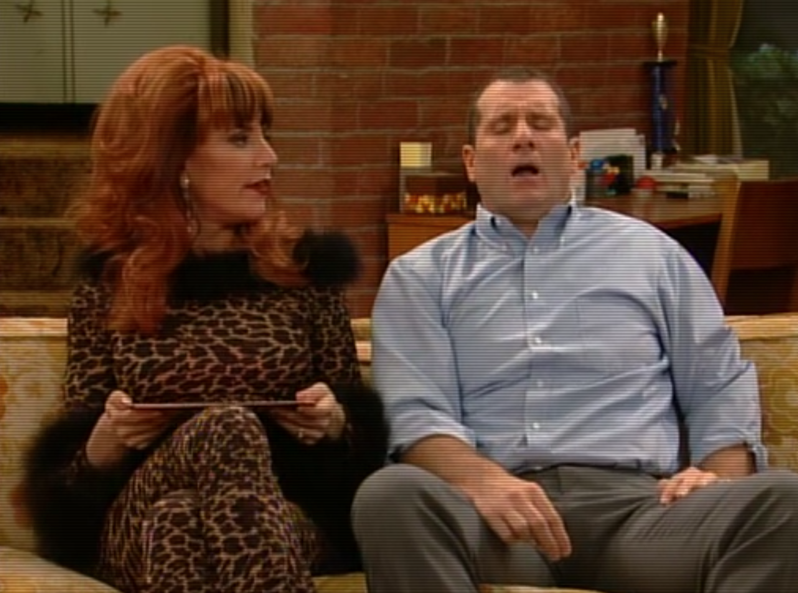 |
| 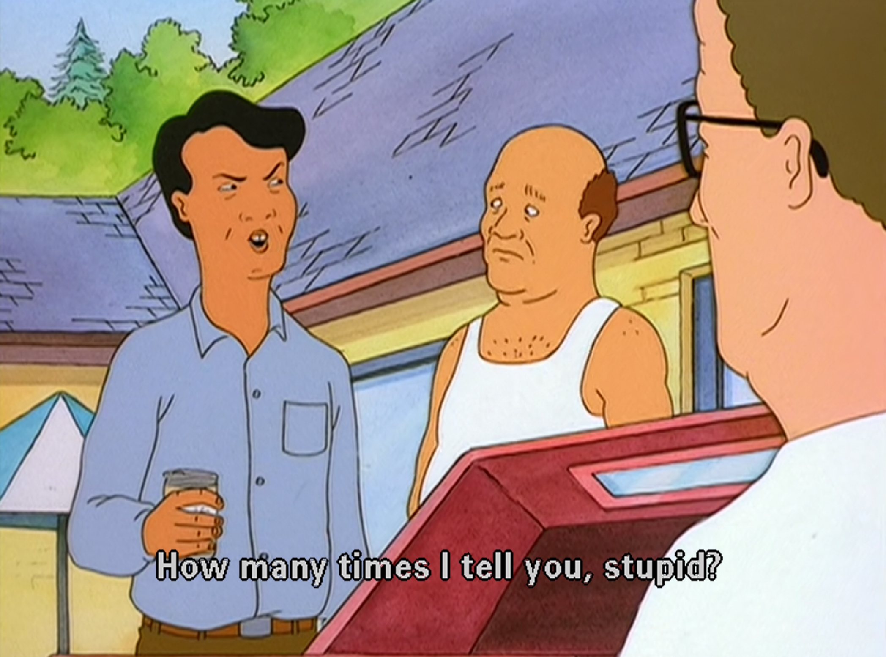 | 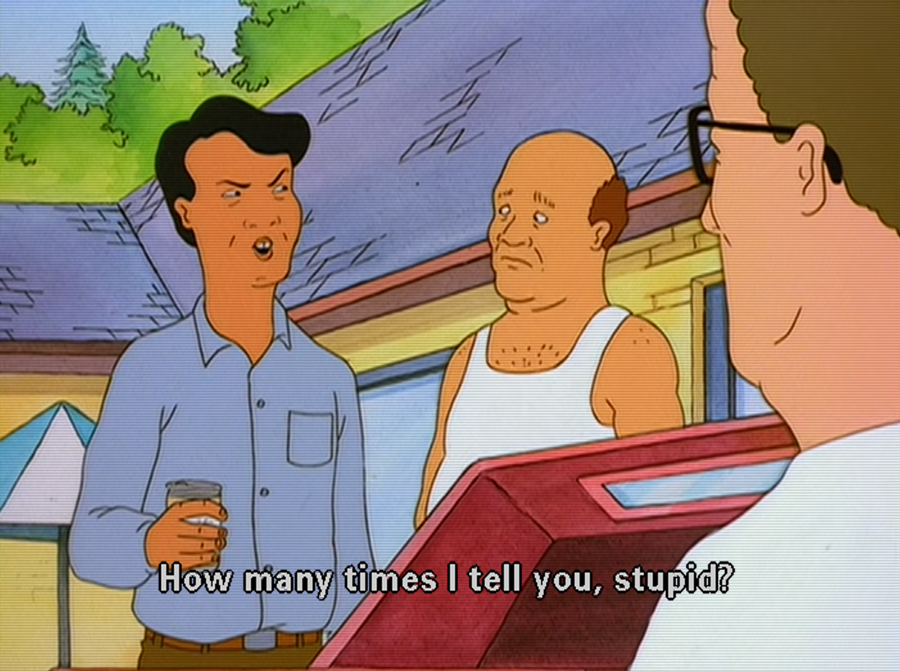 |
| 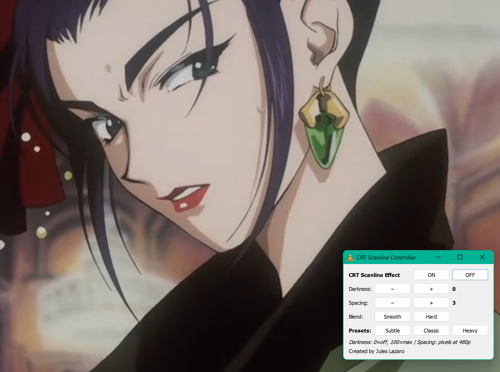 | 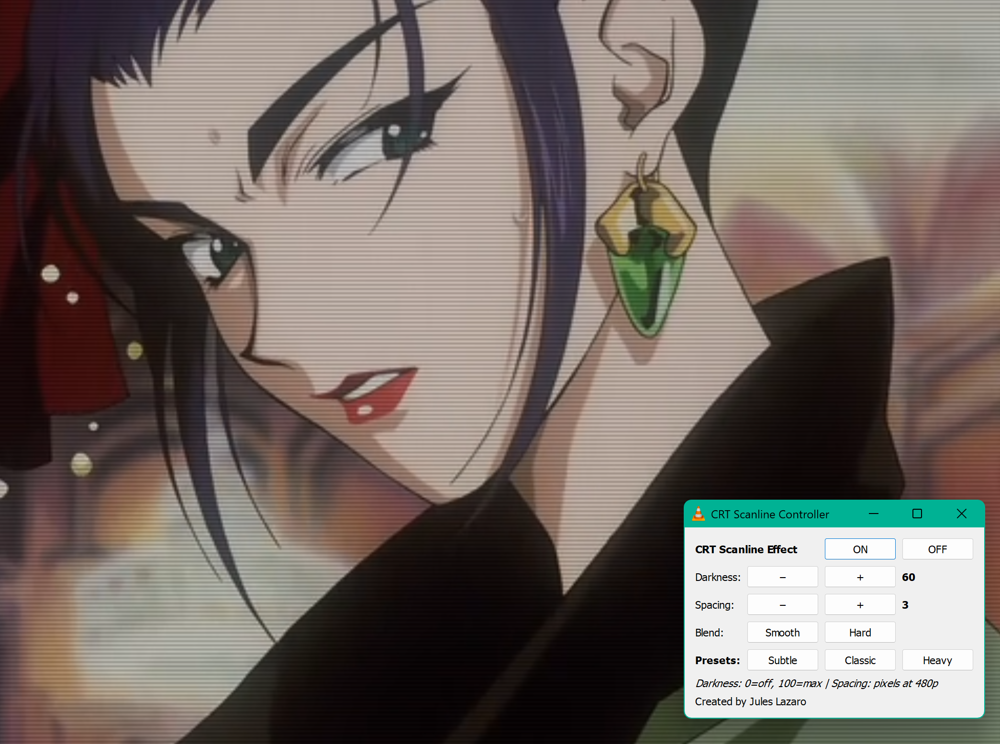 |
|  |  |
| 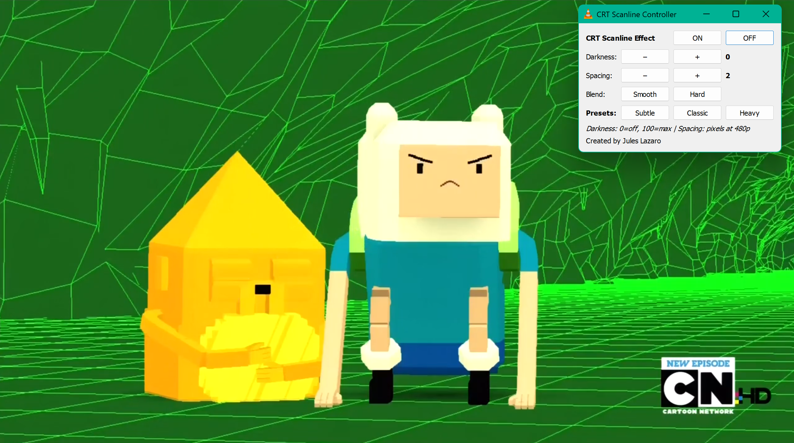 |  |

---

### 🎚️ Intensity Comparison — Low vs High

| 🔴 Filter OFF | 🟡 Low Intensity | 🔵 High Intensity |
|:---:|:---:|:---:|
| 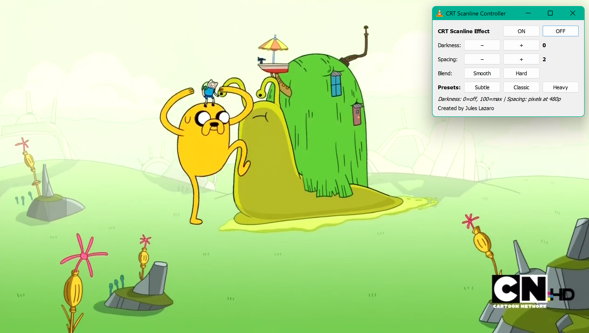 |  | 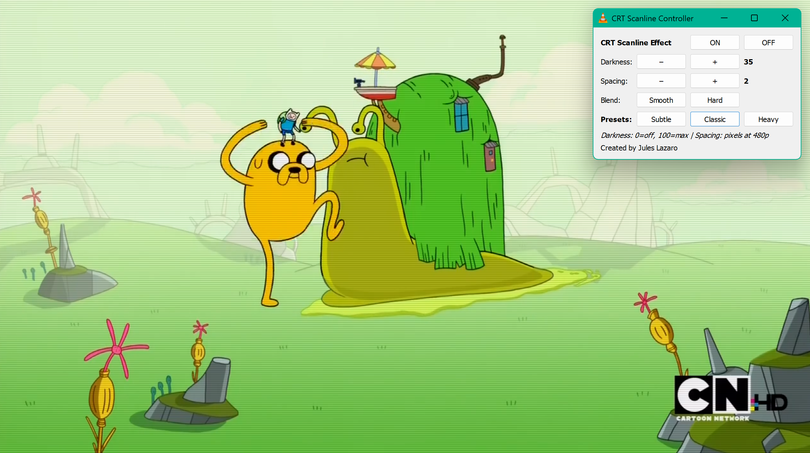 |
---

## ✨ Features

🎛️ **Authentic CRT scanline simulation** — cosine-wave brightness modulation on the luma plane mimics the gaussian beam profile of real CRT phosphor lines.

📐 **Resolution-aware auto-scaling** — scanline spacing scales relative to 480p (NTSC reference), and darkness scales relative to 1080p. A 360p video gets fine, subtle lines; a 1080p video gets the full effect. The visual density stays consistent regardless of source resolution.

⚡ **Zero-cost bypass** — Simply turn it on or off in the view menu - Off short-circuits the filter entirely, passing frames through with no processing overhead.

🎚️ **Live adjustment via Lua extension** — a companion control panel (`View → CRT Scanline Controller`) lets you adjust darkness, spacing, and blend mode in real time during playback without restarting VLC.

🎬 **Presets** — Subtle, Classic, and Heavy presets for quick switching between looks.

🔘 **Smooth and hard modes** — smooth blend uses a cosine wave for natural phosphor falloff; hard mode produces sharp alternating bright/dark bands.

✅ **Works with hardware acceleration** — tested and confirmed working with Direct3D11 hardware-accelerated decoding enabled. No need to change default VLC settings.

---

## 📊 Parameters

| Parameter | Range | Default | Description |
|:----------|:-----:|:-------:|:------------|
| `crtscanline-darkness` | 0–100 | 35 | 🌑 Scanline intensity at 1080p reference (auto-reduced for lower res) |
| `crtscanline-spacing` | 1–20 | 2 | 📏 Scanline period in pixels at 480p reference (auto-scaled to video res) |
| `crtscanline-blend` | on/off | on | 🌊 Smooth cosine-wave blending vs hard alternating lines |

---

## 🔧 Build

> **Prerequisites:** Visual Studio 2022/2026 with "Desktop development with C++" workload, and the VLC 3.0.x SDK extracted to `C:\vlc-sdk\`

```bat
:: Open "x64 Native Tools Command Prompt for VS" from Start Menu
cd C:\crt-scanline-plugin
build.bat
```

---

## 📦 Install

**Option A** — Automated:
```bat
:: Right-click > Run as administrator
install.bat
```

**Option B** — Manual:
1. 📁 Copy `build\libcrt_scanline_plugin.dll` → `C:\Program Files\VideoLAN\VLC\plugins\video_filter\`
2. 📁 Copy `lua\crt_scanline_controller.lua` → `C:\Program Files\VideoLAN\VLC\lua\extensions\`
3. 🔄 Run `vlc-cache-gen.exe` or delete `plugins.dat` to refresh the plugin cache

---

## 🚀 Enable

1. Open VLC → `Tools` → `Preferences` → Show settings: **All**
2. Navigate to `Video` → `Filters` → ☑️ check **"CRT Scanline video filter"**
3. Click **Save**, restart VLC
4. `View` → **CRT Scanline Controller** for live adjustments 🎛️

---

## 💻 Command Line Usage

Basic:
```bat
vlc --video-filter=crtscanline video.mp4
```

Custom settings:
```bat
vlc --video-filter=crtscanline --crtscanline-darkness=50 --crtscanline-spacing=3 --no-crtscanline-blend video.mp4
```

---

## 🔍 Troubleshooting

> ⚠️ **If the scanline effect does not appear**, try disabling hardware-accelerated decoding:
>
> `Tools` → `Preferences` → `Input/Codecs` → Hardware-accelerated decoding → **Disable**
>
> This forces VLC to use software decoding, which guarantees planar YUV frames reach the filter. In most configurations this is **not necessary** — the plugin has been tested and works with Direct3D11 hardware acceleration enabled.

---

## 🛠️ Technical Details

| | |
|:--|:--|
| **Architecture** | Native VLC `video filter` module (C99), compiled as a standalone DLL |
| **Processing** | Operates on planar YUV frames (I420, J420, YV12, I422, etc.) — modulates Y plane per-row; chroma passes through unchanged |
| **Compatibility** | VLC 3.0.x on Windows 64-bit — SDK from 3.0.23, ABI-compatible with any 3.0.x install |
| **Compiler** | MSVC with `/std:c11` (C11 required for VLC header compatibility) |

---

## 💡 Why This Didn't Exist Before

VLC, unlike mpv or RetroArch, does not expose a user-facing shader pipeline. GPU effects must be compiled as C modules linked against VLC's internal API.

---

## 📄 License

LGPL v2.1+ (same as VLC)

---

## 👤 Author

**Created by Jules Lazaro**
